# Modular Unity Synthetic Data Pipeline Design

**Date:** 2026-09-08

**Status:** Proposed for review; planning only, no implementation authorized by this document.

**Companion plan:** [Implementation plan](2026-09-08-modular-unity-pipeline-implementation-plan.md)

## Outcome

Turn the existing generator into a reusable, Inspector-driven dataset authoring tool. A user creates a dataset project, adds class names, drops imported 3D models into those classes, selects saved defaults, previews the results, and generates data for the current Python validation, split, training, evaluation, and webcam workflow.

For example, `MedicalObjects` can contain `syringe` and `vial`, with several models per class. `Animals` can contain `dog` and `cat`. Neither project requires a new enum, a new capture scene, a new Python package, or hand-edited label mappings.

“Model” has two meanings here: a **3D asset** used to render training images and a **detector checkpoint** used by Python. The design handles both explicitly.

## Review basis and current constraints

Reviewed the root, Unity, and Python operating guides; the original detector and mixed-device designs/plans; the Python restructure and iOS selector designs/plans; root completion records; nested iOS documentation; and `Sources/SyntheticDataGenerator.txt`. Checked the relevant runtime, Editor, Python source, configs, and package manifests against those records.

Historical documents contain superseded paths and unfinished checkboxes for subsequently completed work. Current source and the September 8 completion records establish the active Python layout: `src/pokemon_detector`, `data/generated`, `data/prepared`, `runs`, and `models`. The removed real-data annotation/trial workflow is not part of this proposal. Evaluation currently uses `evaluation/<split>/report.json`.

| Current coupling | Evidence | Planned change |
| --- | --- | --- |
| Exactly three labels | Unity `Runtime/Domain/PokemonClass.cs`; Python `domain.py` | Dataset-owned class registry |
| Exactly one prefab per class; every Pokémon mandatory | `Runtime/Scene/PokemonPrefabCatalog.cs` | One or more variants per user-defined class |
| Three-class balancing and three-position fallback | `FrameRecipeSampler.cs` | Class-count-independent scheduler and bounded general placement |
| Maximum three objects | `GenerationConfig.ValidateOrThrow()` | Independent configurable object count |
| Fixed five device profiles and weights | `CaptureProfileCatalog` | Inspector-editable capture profiles |
| Lighting, scale, and size-band rules scattered in code | Sampler, `ProjectedObjectPlacement`, capture controller | Resolved preset values consumed by sampling and projection |
| Scene name and scene path required | `CaptureRunWindow.cs`, `CaptureRunCommand.cs` | Project-selected generic rig |
| Mixed-device toggle overwrites custom ranges | `CaptureSceneRunner.CreateRun()` | Preset applied explicitly before capture; immutable resolved snapshot |
| Class names/colors repeated across Python | Parser/domain, validator, splitter, metrics, evaluator, overlays, detector, webcam | Explicit taxonomy passed through all boundaries |
| “Expected frame count” also enables fixed mixed-profile gates | `dataset/validator.py` | Separate completeness checks from configurable distribution policy |
| Review assumes five profiles and 20 overlays each | `dataset/overlay.py` | Quotas resolved from the selected quality policy |
| Only checkpoint basename `yolo26n.pt` accepted | `training/config.py` | Validated local Ultralytics detection checkpoint selection |
| Skinned vertices cached for a fixed pose | `MeshVertexCache.cs` | Fixed pose in first release; explicit pose/cache seam for animation later |

The existing deterministic recipes, mesh-based placement repair, native-resolution rendering, YOLO normalization, atomic writer, background grouping, and validation gates are valuable foundations to retain.

## Approaches considered

1. **Recommended: asset-based configuration over the existing engine.** Introduce dataset projects, model definitions, presets, and an Inspector. Generalize the Unity–Python contract in parallel with the new authoring path. This provides reuse without replacing tested geometry and output code.
2. **Only improve the existing capture window.** Lower initial effort, but new classes still require enum and Python edits. It does not meet the drag-and-drop requirement.
3. **Rebuild as a general plugin framework or standalone product.** Offers more extension points but adds packaging, plugin discovery, and migration work before improving the user workflow. Defer until the in-project tool is proven with a second category.

## First-release scope

- Axis-aligned 2D object detection with the existing PNG, YOLO TXT, and JSONL workflow.
- Static models and skinned models captured in a fixed pose. Animation pose sampling is a proposed follow-up unless the user selects it for the first release.
- Imported Unity model assets and prefabs. GLB uses the installed glTFast importer; other formats must already import into Unity as renderable assets.
- Multiple class sets and multiple visual variants of each class.
- Perspective camera settings, native output profiles, object poses/placement, lighting, backgrounds, quality limits, and reusable defaults.
- Existing Ultralytics detection training and inference; YOLO26n remains the default. Additional compatible local detection checkpoints are selectable and tested against the installed dependency versions.
- No new Unity, URP, or Python dependency upgrade is required by the design. Retain Unity `6000.3.8f1`, URP `17.3.0`, glTFast `6.20.0`, and Python `>=3.12,<3.13` with the current lockfile.

## User workflow

1. Choose **Synthetic Data > New Dataset Project**, name it, and select a preset such as **General Objects** or **Mixed Device**.
2. In the project Inspector, click **Add Class**, enter a name, and drag one or more imported models/prefabs into its **Model Variants** list. Dropping a second dog model creates another variant of `dog`, not another detection class.
3. The tool creates a capture wrapper and model definition, discovers renderable geometry, preserves materials, centers/grounds the model, and shows a preview. The user can correct its forward/up orientation and scale from the same Inspector.
4. Drag background textures, or a Unity Project folder of textures, into **Backgrounds**. Show the number of unique background groups and insufficient-split warnings immediately.
5. Expand **Camera**, **Objects**, **Lighting**, or **Quality** only when custom settings are needed. Every range has units and a reset control; the effective value and its source remain visible.
6. Click **Preview Sample** or **Next Sample**. Inspect RGB plus boxes, class/variant names, native resolution, and rejection reasons. Preview uses the actual generation pipeline and does not create a dataset run.
7. Click **Generate Smoke Run**, inspect the small output, then set the production frame count and click **Generate Dataset**. Show accepted/requested counts, retries, current profile, output folder, and Stop.
8. The completion panel provides **Open Output**, **Copy Validate Command**, **Copy Split Command**, and **Copy Train Command**. Python discovers the class map from the generated run; the user does not maintain a second `classes.yaml`.

The first version generates commands rather than launching lengthy training automatically. A Python launcher can be added afterward without changing dataset contracts.

### Inspector outline

```text
Dataset Project: Medical Objects
Preset: General Objects       [Save As Preset] [Reset Overrides]

Classes
  syringe   ID 0   Variants: [Syringe A] [Syringe B] [+ Drop Model]
  vial      ID 1   Variants: [Vial A]               [+ Drop Model]
  [Add Class]

Backgrounds: [Background Set]   98 groups
Camera      [Use Scene Camera as Base] [Settings...]
Objects     [Pose / Position / Size...]
Lighting    [Settings...]
Quality     [Settings...]

Run: medical-smoke-001   Frames: 20   Seed: 42
[Preview Sample] [Next Sample] [Generate Smoke Run] [Generate Dataset]
```

## Configuration architecture

Use four asset types, with most edits accessible inline in the project Inspector:

| Asset/type | Responsibility | Dependencies |
| --- | --- | --- |
| `DatasetProject` | Project identity, ordered class definitions, model references, selected preset/backgrounds, project overrides | Asset references; no capture execution |
| `ObjectDefinition` | Stable variant identity, source model, prepared wrapper, orientation, geometry selection, optional pose/placement overrides | Imported model; no class ID embedded in the source |
| `GenerationPreset` | Reusable defaults for camera, native profiles, object distribution, lighting, background appearance, and quality | Serializable settings groups |
| `BackgroundSet` | Texture references and stable group identities | Texture assets |
| `ResolvedGenerationConfig` | Deep, validated run snapshot with resolved asset identities and effective values | Produced from the four assets before capture |
| `CaptureRig` | Camera, background renderer, lights, generated-root container and scene lifecycle | Resolved config and existing renderer services |

`ClassDefinition` is a serialized row owned by `DatasetProject`, not an asset the user must create separately. Each row owns its label identity and a list of `ObjectDefinition` references. This keeps one model reusable in different datasets without changing its source components.

Unity ScriptableObjects support asset-based shared data and Inspector references. Use the serialization APIs for Inspector changes and Undo/prefab override support. These fit the existing Unity workflow. [Unity ScriptableObject documentation](https://docs.unity3d.com/6000.3/Documentation/Manual/class-ScriptableObject.html), [SerializedObject documentation](https://docs.unity3d.com/6000.3/Documentation/ScriptReference/SerializedObject.html).

### Defaults and overrides

- Resolution order: selected preset → explicitly enabled project overrides → per-model pose/placement overrides → temporary run ID/count/seed/output overrides.
- Per-model overrides may change object orientation, scale/size targets, and allowed placement; they cannot change camera resolution or global class identity.
- **Save As Preset** saves the resolved shared settings into a new preset; dataset labels/model references remain in the project.
- A personal default preset preference affects newly created projects only. Existing projects retain their explicit references. Machine-local output paths/preferences remain outside shared assets.
- Starting a run snapshots all inputs. Inspector edits affect the next run. No runtime `ApplyMixedDeviceSettings()` call silently resets user settings.
- Resetting an override restores the inherited value; it does not edit a shared preset.

### Initial General Objects preset

These are proposed starting values, not a claim that every category will train well with them. The preview and per-model overrides are the path to adjustment.

| Setting | Initial value |
| --- | --- |
| Native capture / reference model input | One `Square` profile at 640 × 640, weight 1; reference input 640 |
| Seed / smoke frames | 42 / 20 |
| Camera | Rig-local position `(0,0,-5)`, rotation `(0,0,0)`; translation/rotation randomization off; vertical FOV 45–60°; clipping 0.01–100 units |
| Positive objects / negatives | 1–3 objects per positive frame; 25% negative frames |
| Placement | Camera-relative screen placement; center region 0.1–0.9 on each axis; depth 1.5–5 units; fit full projected geometry |
| Pose | Pitch −20–20°, yaw −35–35°, roll −12–12° relative to the corrected model orientation |
| Size | One Medium stratum, longest side 80–184 reference-model pixels; minimum native width and height 8 pixels |
| Lighting | One Normal stratum; ambient 0.6–1.2; point intensity 0.5–2; temperature 4,500–7,500 K |
| Background appearance | Scale 1–1.3; brightness 0.8–1.2; contrast 0.85–1.15; crop offset up to 0.1; blur 0–1 |
| Geometry quality | At most 25% crop; reject projected containment at or above 0.95; at most 20 attempts per output frame |
| Review | Smoke: inspect all 20 frames. Production: 100 overlays, profile quotas allocated across enabled profiles, and coverage of required classes/strata/negatives |

The baseline and mixed-device Pokémon presets copy their actual existing settings and sampling policies, including their legacy object-count distribution, rather than borrowing these General Objects defaults. Structural validity is always mandatory. Production distribution gates use the preset's declared targets/tolerances; smoke mode keeps those distributions informational. Review requirements refer only to enabled strata and explain when the requested sample size cannot cover them.

### Class identity and variants

- Every class has an immutable stable key, stored integer YOLO ID, machine name, display name, and overlay color.
- Assign IDs contiguously from zero when classes are created. Reordering Inspector rows does not change IDs. Appending a class assigns the next ID and creates a new taxonomy revision.
- After first capture, changing a machine name, deleting a class, or repurposing an ID requires a new taxonomy revision/project copy. Existing artifacts retain their snapshots. Do not silently close ID gaps or relabel old images.
- A new taxonomy revision is a distinct dataset contract. Do not merge runs across revisions by matching IDs alone. Automatic dataset merging is outside the first release.
- Variants have stable IDs independent of class IDs and are sampled within the selected class. The same class remains balanced regardless of its number of variants.
- Disabled variants are allowed if each class retains at least one valid variant. A class cannot simply be disabled while retaining a sparse YOLO mapping; create a separate class-set revision instead.
- Start with equal class scheduling and equal variant scheduling. Weighted class/variant sampling can follow once the basic workflow is proven; configurable profile/lighting/size weights remain included.

### Model preparation

Create wrappers under `Assets/SyntheticData/Projects/<project>/Models/`. Root and `ModelHolder` stay at unit scale; preserve imported model-child transforms/materials and apply capture variation at the instance root. Reuse the established Pokémon holder contract when migrating its three wrappers.

Discover enabled renderers, bounds, required readable mesh data, materials, and fixed-pose skinning. Provide explicit renderer inclusion/exclusion for helper meshes and choose one LOD representation. Labels must use the same renderer selection as RGB, not every inactive renderer in a hierarchy. Report missing renderers, zero bounds, missing materials, unreadable meshes, nested conflicting labels, and unsupported dependencies with the affected asset and a repair action.

The tool proposes orientation from bounds but cannot infer a semantic front reliably. Show a forward/up gizmo and an **Apply Orientation** preview. Auto-centering and fit reduce setup work; semantic class names and visual correctness still need human inspection.

Imported scripts, Animator state changes, physics, and procedural deformation must not run uncontrolled in a capture wrapper. Capture should use a controlled visual hierarchy and a fixed pose. Animated poses later require pose sampling before projection and an explicit cache refresh after pose changes.

## Camera, placement, and quality controls

| Group | User controls and units |
| --- | --- |
| Camera pose | Base position in Unity units; base Euler rotation in degrees; optional translation/rotation ranges relative to the capture rig; near/far clipping; vertical FOV range |
| Native profiles | Named width/height pairs, weights, and safe margins in normalized viewport coordinates; custom profile names allowed |
| Object orientation | Base orientation plus independent pitch/yaw/roll min/max in degrees; lock any axis with equal bounds |
| Object placement | Screen-space center region and camera depth range, or fixed-scale world-space volume mode; explicit choice between modes |
| Apparent size | Target longest side in model-input pixels; native minimum width and height separately; short-side constraints matter for thin syringes |
| Object count | Minimum/maximum per positive frame, separate negative-frame fraction; independent of number of classes |
| Lighting | Ambient and point-light ranges, temperature in kelvin, relative light placement, configurable lighting strata |
| Background | Texture selection, crop, scale, brightness, contrast, blur, temperature |
| Quality | Crop limit, projected-box containment limit, retry budget, review sample policy, class/profile/size/lighting distribution tolerances |

**Camera-relative screen placement is the default:** resolve camera pose first, sample object orientation and depth, then fit actual rotated geometry to the desired screen region and projected size. A camera rotation must change the view of the object rather than rotating the object with the camera by accident. World-space volume mode keeps the authored object scale and rejects invalid projections; do not simultaneously solve an incompatible screen-size target.

For all modes, snapshot and restore camera transform, FOV, clipping planes, aspect mode, lights, background, and generated objects on success, stop, or failure. Reuse the mesh-based placement solver; remove decisions based on profile names such as `Name != "Baseline"`.

Use a configurable square **reference model input size**, default 640, for apparent-size metadata. Native PNG resolution is a separate setting. Record the reference size in the run. Training initially requires its `image_size` to agree with this contract so size gates retain their meaning. Legacy snapshots assume their existing 640 reference.

Arbitrary categories expose limits of the current geometry. A long thin object may satisfy the longest-side band but fail minimum short-side visibility. Preflight should sample each variant against each enabled profile and report infeasible combinations before a long run. Perspective clipping, renderer selection, transparency, and heavy overlap need visual checks. Projected-box containment is a useful rejection heuristic, not a pixel-accurate visibility guarantee. Instance-mask visibility and segmentation are separate extensions.

## Runtime pipeline and determinism

```mermaid
flowchart LR
    A[Dataset Project + Preset + Models] --> B[Resolve and validate snapshot]
    B --> C[Deterministic frame recipe]
    C --> D[Build scene and fit geometry]
    D --> E[Project labels and check quality]
    E --> F[Capture RGB and write run]
    F --> G[Python validate and review]
    G --> H[Grouped split and dataset.yaml]
    H --> I[Train, evaluate, webcam]
```



Keep `FrameRecipeSampler` as the coordinator with focused samplers for object selection, camera pose, placement targets, lighting, and background appearance. Each consumes an explicitly derived random stream and writes a recipe; the scene builder never samples hidden random values. Move the current hidden target-size sampling out of `ProjectedObjectPlacement.Fit` into the recipe.

Recipes record class ID, variant ID, per-frame object instance ID, requested pose/depth/size, sampled camera/light/background settings, profile, resolution, frame index, and retry index. A resolved frame records the actual world pose/scale and fitted screen position. Avoid mutating the input recipe inside the geometry solver.

Retries preserve class, variant, object count, capture profile/resolution, lighting stratum, and size stratum; retry-specific streams change pose/placement/appearance within those constraints. Two instances of the same class must have separate instance streams. Record a `sampler_version`; new sampling behavior need not reproduce old seed-to-frame mappings, but must be deterministic within its version. Existing datasets are not regenerated as part of migration.

## Unity–Python export contract

Retain the current folders and normalized YOLO row format. Add explicit versioned metadata:

```text
Python-ModelTraining/data/generated/<run-id>/
  images/frame_000001.png
  labels/frame_000001.txt
  manifest.jsonl
  run-config.json
  taxonomy.json
  run-status.json
  rejections.jsonl
```

`taxonomy.json` schema version 2 contains `dataset_id`, `taxonomy_revision`, a content hash, and class entries `{id, key, name, display_name, color}`. IDs are dense, names unique, and keys immutable. Use one canonical UTF-8 representation for hashing in C# and Python, defined by a shared literal test fixture. The hash covers the semantic identity mapping; display-only color changes do not alter label identity.

`run-config.json` version 2 contains requested frame count, seed, sampler version, reference model size, the full resolved preset/quality policy, taxonomy hash, background group identities, and model variant identities/dependency hashes. Asset GUIDs and hashes provide provenance; replay still needs matching Unity assets and renderer versions.

Manifest rows retain existing fields and add schema version, taxonomy hash, variant/instance IDs, requested recipe values and resolved poses, camera pose, and reference input size. `class_name` is checked against the taxonomy; it is never inferred from prefab names.

Write config and taxonomy before frames. Start `run-status.json` as `in_progress`; atomically change it to `completed` only after exact PNG/TXT/manifest counts agree. On stop/error, persist `cancelled`/`failed` and accepted count. A partial dataset is inspectable but cannot pass the training gate. First release does not resume runs or overwrite existing directories. Persist bounded rejection records and aggregate counts rather than retaining an unbounded in-memory list.

### Compatibility rules

- New Python code accepts legacy unversioned Pokémon runs through an isolated legacy reader and frozen legacy taxonomy/policies. Retain existing optional mixed-device fields.
- Missing taxonomy on schema version 2, unsupported schema versions, conflicting class names, or invalid hashes are errors; never silently fall back to Pokémon.
- Legacy prepared datasets and checkpoints remain usable with their exact existing name mapping. New prepared datasets carry their source taxonomy, schema, and quality evidence alongside `dataset.yaml`.
- The existing Python application requires a coordinated update before it can read new categories. Keeping the YOLO format alone does not remove its current hard-coded class restrictions.

## Python changes

1. Introduce immutable `Taxonomy` and `DatasetContract` loaders; keep `pokemon_detector` as the import path during this change to avoid another folder migration.
2. Make `YoloBox` validate strict nonnegative integer identity and geometry. Validate membership/name agreement at parsing, dataset, evaluation, and inference boundaries using the loaded taxonomy. Do not coerce JSON booleans or fractional values to valid class IDs.
3. Pass taxonomy through parser, validator, overlay renderer, splitter, gallery, metrics, evaluator, and inference. Remove fixed three-color and three-class assumptions. Generate deterministic fallback colors for any class count.
4. Read version-2 expected counts and distribution targets from the snapshot. Completeness checks must work for a custom square-only run without demanding five device profiles. Production policies fail missing required classes; smoke policies report coverage without applying statistically unsuitable production proportions.
5. Generate `dataset.yaml` names directly from the taxonomy. Ultralytics already accepts dataset-specific class mappings in its detection dataset format. [Ultralytics detection dataset documentation](https://docs.ultralytics.com/datasets/detect/).
6. Preserve background isolation and the existing ratio/exact-count split modes. Report impossible exact counts rather than leaking groups. Store source contract/hash and frame membership with fresh validation evidence. Fail a training split that has no positive examples for a required class; report held-out coverage explicitly.
7. Allow a valid local `.pt` detection checkpoint instead of enforcing a single basename. Check model task/backend compatibility before training; allow a pretrained source taxonomy to differ during fresh fine-tuning, since the destination dataset defines the new classes. Evaluation/inference require the trained checkpoint taxonomy to match the selected dataset.
8. Save taxonomy and source dataset provenance with each training run, including a sidecar beside `best.pt`. Load names from checkpoint metadata for inference and cross-check the sidecar when present. Legacy Pokémon checkpoints remain supported.

The default training configuration, MPS/CPU paths, validation-first flow, and normal webcam commands remain recognizable. Adding another ML backend, cloud execution, or new mobile model parsing is not required for category reuse.

## Migration and acceptance

Migrate additively: implement readers/contracts first, introduce new authoring assets and a generic rig, then convert Pokémon into an example dataset project. Keep old components/assets until the new path passes regression gates. Preserve `.meta` GUIDs where types/assets remain; use an explicit migration utility for incompatible field/type changes rather than bulk text renames.

The decisive test is a second category created through the Inspector with no C# or Python edits. Use a user-supplied non-Pokémon model when available; procedural proxies can prove plumbing but cannot establish useful syringe/dog/cat detection quality.

Acceptance requires:

- A one-class project with multiple variants, a two-class project, and a project with more than three classes generate valid runs.
- More than three object instances work in a feasible layout, independently of class count.
- Custom native profiles, camera poses, per-axis rotations, and model overrides visibly affect previews and exported snapshots.
- Same seed/snapshot/version yields the same recipes and labels; no claim of GPU byte-identical PNGs across environments.
- Preview, capture, cancel, error, and Play Mode reload restore the rig correctly and never write overlays into RGB.
- Python validation, grouped split, a short training smoke, evaluation, and fake-camera inference work with non-Pokémon labels.
- Both retained Pokémon datasets/checkpoints still load through the compatibility path without modifying their contents.
- Thin and fixed-pose skinned model fixtures have geometrically correct labels and reviewed rendered overlays.

Latest Python restructure evidence reports 143 passing non-slow tests. Its targeted Unity verification was blocked before discovery by licensing initialization. Those are historical results, not tests run during this planning task; implementation must establish fresh baselines and obtain actual Unity test XML plus graphics-backed captures.

## Deferred extensions

Animation clip/time sampling with pose-aware geometry refresh; surface/contact placement and physics; material variation for categories that need it; segmentation/instance visibility; automated Python process launching; additional training backends; packaging as a reusable Unity package; generic iOS category/model support. The current iOS parser/model UI remains Pokémon-specific until separately generalized.
